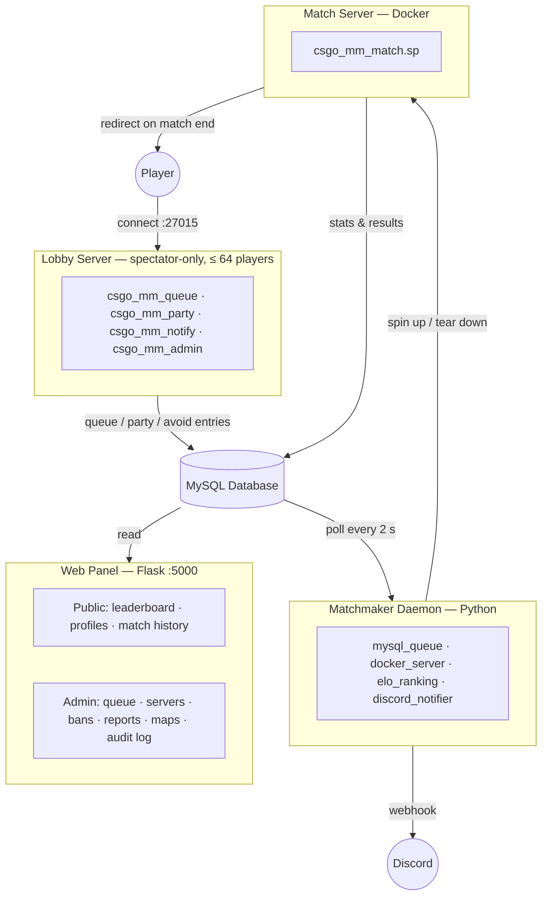

# CS:GO Competitive Matchmaking System

A community-driven competitive matchmaking system for CS:GO Legacy, providing automated 5v5 competitive matches with ELO-based ranking, persistent statistics, and a seamless player experience.

## Overview

Since Valve shut down official CS:GO matchmaking servers, this project recreates the competitive matchmaking experience using community tools. Players join a lobby server, queue via chat commands, get matched by skill level, and are automatically redirected to dedicated match servers.

### Key Features

- **Spectator-only lobby**: The lobby server is a pure waiting room — players are locked to spectator, no rounds ever start; up to 64 players can queue simultaneously (CS:GO engine hard limit)
- **Chat-based queue**: `!queue`, `!leave`, `!status`, `!rank`, `!top`, `!stats`, `!lastmatch`, `!recent`
- **Command discoverability**: Welcome panel on connect + `!help` reopens the full command guide at any time — no chat flooding (SourceMod suppresses `!` commands from public chat)
- **Party system**: `!party invite/accept/decline/leave/kick/list` — queue as a group, parties are kept together in the same match
- **Avoid system**: `!avoid <name>` prevents two players from being matched together for 7 days; `!avoidlist` to review
- **ELO-based matchmaking**: Dynamic spread, placement matches, skill-balanced teams
- **Ready check system**: 30-second accept/decline window
- **Automated match servers**: Docker containers spun up on demand with competitive configs
- **Automatic redirection**: Players seamlessly moved between lobby and match servers
- **Knife round + side choice**: Winner's captain picks CT or T to start
- **In-match features**: Tactical pauses (`!pause`/`!unpause`), surrender vote (`!ff`), live score (`!score`), player reporting (`!report`)
- **Persistent statistics**: Kills, deaths, assists, headshots, win rate, ELO history
- **Abandon penalties**: Progressive cooldowns (30 min → 7 days) for players who quit mid-match
- **Web panel**: Leaderboard, player profiles, match history — login with Steam
- **Admin panel**: Full server management from the browser — queue monitor, live server controls, player search, ban/unban, map pool CRUD, activity audit log; no game client needed
- **Seasonal rankings**: Periodic ELO resets with historical data preservation
- **Discord notifications**: Match found, results, rank changes via webhooks
- **Multi-lobby scaling**: Run multiple lobby servers against the same DB/matchmaker — each tagged with `LOBBY_SERVER_ID` for admin visibility
- **Cloud-aware installer**: Auto-detects AWS, GCP, Azure, Hetzner, DigitalOcean, OVH and shows provider-specific firewall setup instructions

## Architecture



> Multiple lobby servers can share the same MySQL database and matchmaker — the existing DB-polling architecture handles it transparently. Set a unique `LOBBY_SERVER_ID` on each lobby instance for admin visibility.

### Modular Design

The Python matchmaker uses abstract interfaces (ABC) for all swappable components:

| Component | Default | Can be replaced with |
|-----------|---------|---------------------|
| Queue backend | MySQL polling | Redis pub/sub, RabbitMQ |
| Server orchestration | Docker API | Kubernetes, Podman |
| Ranking system | ELO | Glicko-2, TrueSkill |
| Notifications | Discord webhooks | Slack, Telegram, email |

Change backends by setting `QUEUE_BACKEND`, `SERVER_BACKEND`, `RANKING_BACKEND`, `NOTIFICATION_BACKEND` in `config.env`.

## Quick Start

### Prerequisites

- Linux server (Ubuntu/Debian, CentOS/RHEL, Fedora, or Arch) — bare-metal or cloud VM
- 4 GB RAM, 2 CPU cores, 50 GB disk (minimum)
- Steam account with GSLT tokens ([generate here](https://steamcommunity.com/dev/managegameservers) with AppID 730)
- Your SteamID (find yours at [steamid.io](https://steamid.io)) — needed to seed the first admin account

### Installation

```bash
git clone https://github.com/YOUR_USERNAME/CSGO-Matchmaking.git
cd CSGO-Matchmaking
chmod +x install.sh
sudo ./install.sh
```

The interactive wizard walks you through every required decision, then handles the rest autonomously:

1. **System packages** — installs SteamCMD, MySQL/MariaDB, Python, Docker, and all dependencies
2. **MySQL setup** — uses an existing instance or installs a fresh one, creates the database and user
3. **Network** — lobby port (27015), web panel port (5000), match server port range (27020–27029)
4. **Matchmaking rules** — ELO spread, players per team, queue timeout
5. **CS:GO server** — downloads the dedicated server via SteamCMD (can take 20–30 min on first run)
6. **Map pool** — choose which competitive maps to include
7. **GSLTs** — your Game Server Login Tokens for lobby and match servers
8. **Web panel** — admin token (auto-generated), Discord webhook (optional), your SteamID for the first super-admin account
9. **Cloud firewall notice** — if a cloud provider is detected, shows provider-specific port-opening instructions before you confirm

When the wizard finishes, the installer:
- Installs SourceMod, MetaMod, and all plugins
- Compiles match-server and lobby plugins using the installed `spcomp` binary
- Builds the Docker image for match servers
- Opens the required ports (UFW / firewalld / iptables)
- Creates and **starts** all three systemd services immediately

> **Interrupted install?** Re-run `sudo ./install.sh --update`. It loads your existing `config.env`, skips completed steps, and picks up where it left off safely.

### After Installation

```
Admin panel:  http://YOUR_SERVER_IP:5000/admin   (sign in with Steam)
Leaderboard:  http://YOUR_SERVER_IP:5000
```

On your first visit to the admin panel, sign in with the Steam account whose SteamID you provided during the wizard. That account is automatically seeded as the super-admin.

### Admin Panel at a Glance

Everything you need to run the server is available from the browser — no game client required.

| Page | What you can do |
|------|-----------------|
| **Dashboard** | 8 live stat cards (matches, queue, bans, reports, players, ports, GSLT tokens) + nav tiles |
| **Queue monitor** | See every queued player with wait time and lobby origin; kick anyone instantly |
| **Servers** | RCON broadcast to the lobby or any live match; cancel a running match |
| **Matches** | Full match history with status filter; force-cleanup stuck containers |
| **Players** | Search by name/SteamID; tabs for banned/abandon history/flagged; ban, unban, set ELO inline |
| **Bans** | Issue bans with duration presets; history preserved on unban (soft-delete) |
| **Reports** | Flagged players (≥ 3 reporters in 30 days); drill-down to individual reports; quick-ban modal |
| **Map pool** | Toggle maps active/inactive, adjust selection weight, add or remove maps |
| **Activity log** | Full audit trail of every admin write action, filterable by admin and action type |
| **Admin roster** | Add/remove admins, change roles (superadmin only) |
| **Seasons** | Start a new season with soft ELO reset (superadmin only) |

Player profiles (`/player/<steam_id>`) also show an **admin overlay panel** — ban status, abandon count, report count with drill-down, current queue status, and quick-action buttons — visible only to logged-in admins.

### Connect & Play

1. Launch CS:GO Legacy
2. Open the console: `connect YOUR_SERVER_IP:27015`
3. You land in **spectator mode** on the lobby server — this is intentional. The lobby is a waiting room only; no rounds ever start here.
4. Type `!queue` in chat to join matchmaking (or `!help` for the full command guide)
5. When 10 players are ready, accept the ready check — you'll be redirected automatically to a dedicated match server

### Service Management

```bash
# Status
sudo systemctl status csgo-lobby csgo-matchmaker csgo-webpanel

# Restart all
sudo systemctl restart csgo-matchmaker csgo-webpanel

# Logs
journalctl -u csgo-matchmaker -f
journalctl -u csgo-webpanel -f
```

## Project Structure

```
CSGO-Matchmaking/
├── install.sh                    # One-command installation wizard
├── config.example.env            # Configuration template (copy → config.env)
├── database/schema.sql           # Full DB schema + seed data + migration history
├── matchmaker/                   # Python matchmaker daemon
│   ├── matchmaker.py             # Main loop
│   ├── factory.py                # Backend wiring (reads QUEUE_BACKEND etc.)
│   ├── db.py                     # MySQL connection helper
│   ├── season_manager.py         # Season start + ELO soft-reset logic
│   ├── rcon_client.py            # Fault-tolerant RCON client (3 retries + backoff)
│   ├── interfaces/               # Abstract base classes (ABC)
│   │   ├── queue_backend.py
│   │   ├── server_backend.py
│   │   ├── ranking.py
│   │   └── notification.py
│   ├── backends/                 # Concrete implementations
│   │   ├── mysql_queue.py        # Queue management (DB polling)
│   │   ├── docker_server.py      # Match server orchestration (Docker SDK)
│   │   ├── elo_ranking.py        # ELO calculation with K-factor and placement
│   │   ├── discord_notifier.py   # Discord webhook notifications
│   │   └── noop_notifier.py      # No-op notifier (when webhooks disabled)
│   └── tests/                    # Unit tests
├── lobby-server/                 # Lobby SRCDS + SourceMod plugins
│   ├── sourcemod/scripting/
│   │   ├── csgo_mm_queue.sp      # Queue, rank, stats, avoid system
│   │   ├── csgo_mm_party.sp      # Party invite / accept / management
│   │   ├── csgo_mm_notify.sp     # Welcome panel, !help, HUD hints, spectator lock
│   │   └── csgo_mm_admin.sp      # In-game admin commands (!mm_ban, !mm_setelo …)
│   └── cfg/server.cfg            # Lobby server config (spectator-only, warmup lock)
├── match-server/                 # Docker match server
│   ├── Dockerfile
│   ├── sourcemod/scripting/
│   │   └── csgo_mm_match.sp      # Full match lifecycle (whitelist, stats, results)
│   └── cfg/                      # Competitive config (10-round halves, knife round)
├── web-panel/                    # Flask web application
│   ├── app.py                    # App factory + blueprint registration
│   ├── models.py                 # DB helpers (query_db, execute_db) + RankInfo
│   ├── config.py                 # Config class (loaded from config.env)
│   ├── extensions.py             # Flask-Caching, Flask-Limiter setup
│   ├── routes/
│   │   ├── admin.py              # All admin routes + _log_action audit helper
│   │   ├── api.py                # JSON REST endpoints
│   │   ├── auth.py               # Steam OpenID login / logout
│   │   ├── home.py               # Landing page
│   │   ├── leaderboard.py        # ELO leaderboard
│   │   ├── matches.py            # Match list + detail scoreboard
│   │   └── players.py            # Player profiles
│   └── templates/
│       ├── base.html             # Shared layout (navbar, flash messages, footer)
│       ├── admin/                # Admin panel templates (11 pages)
│       └── …                     # Public pages (index, leaderboard, match, player…)
├── vendor/                       # Pinned third-party plugin binaries
│   └── sourcemod/plugins/        # levels_ranks.smx, serverredirect.smx
└── installer/                    # Installer modules
    ├── lib/                      # Logging, UI, input, system helpers
    └── steps/                    # 01_packages … 09_services
```

## In-Game Commands

> All commands use the `!` prefix in chat (e.g. `!queue`). SourceMod automatically suppresses the command text from public chat — only the requesting player sees any response, so commands never flood the chat.

### Player Commands (Lobby Server)

| Command | Description |
|---------|-------------|
| `!help` / `!commands` | Open the command guide panel (also shown automatically on first connect) |
| `!queue` / `!q` | Join the matchmaking queue |
| `!queue de_mirage` | Join with a map preference |
| `!leave` | Leave the queue |
| `!status` | Show queue position and elapsed wait time |
| `!rank` | Show your ELO and rank tier |
| `!top` | Show the top 10 players by ELO |
| `!stats` | Show your detailed career statistics |
| `!lastmatch` | Show your most recent match result and ELO change |
| `!recent` | Show players from your last 5 matches |
| `!party` / `!p` | Party management — `!party invite <name>`, `accept`, `decline`, `leave`, `kick <name>`, `list` |
| `!avoid <name>` | Avoid a player for 7 days (they won't be matched with you) |
| `!avoidlist` | View your current avoid list |

### Player Commands (Match Server)

| Command | Description |
|---------|-------------|
| `!score` | Show the current match score |
| `!ff` / `!surrender` | Call a surrender vote (requires 4/5 votes — unconditional loss) |
| `!pause` | Request a tactical pause at next freeze time (1 per team per match) |
| `!unpause` | Signal your team is ready to resume (both teams must confirm) |
| `!report <player>` | Report a player (cheating / griefing / AFK / toxic behavior) |

### Admin Commands (Lobby Server)

> Admins are managed via the web admin panel — no shared passwords. Most administrative tasks (ban, unban, ELO override, match cancel, server broadcast) are available directly from the web panel without ever opening the game.

| Command | Description |
|---------|-------------|
| `!mm_forcestart` | Force start a match with the current queue |
| `!mm_cancelqueue` | Clear all waiting queue entries |
| `!mm_ban <player> <minutes> <reason>` | Ban a player from matchmaking |
| `!mm_unban <steamid>` | Remove a matchmaking ban |
| `!mm_setelo <player> <elo>` | Override a player's ELO |
| `!mm_resetrank <player>` | Reset a player's ELO to 1000 and restart placement |
| `!mm_status` | Show system status (active matches, queue counts) |

## Configuration

The installer generates `config.env` from your wizard answers. Key settings you can tune afterwards:

**Matchmaking**

| Variable | Default | Description |
|----------|---------|-------------|
| `PLAYERS_PER_TEAM` | `5` | Players per side |
| `MAX_ELO_SPREAD` | `200` | Starting ELO tolerance for matchmaking |
| `ELO_SPREAD_INCREASE_INTERVAL` | `60` | Seconds between ELO spread expansions |
| `ELO_SPREAD_INCREASE_AMOUNT` | `50` | ELO points added per expansion interval |
| `READY_CHECK_TIMEOUT` | `30` | Seconds to accept a ready check |
| `WARMUP_TIMEOUT` | `180` | Seconds for all players to connect before warmup cancels the match |
| `POLL_INTERVAL` | `2.0` | Seconds between matchmaker DB polls |

**ELO / Ranking**

| Variable | Default | Description |
|----------|---------|-------------|
| `ELO_DEFAULT` | `1000` | Starting ELO for new players |
| `ELO_K_FACTOR` | `32` | K-factor for established players |
| `ELO_K_FACTOR_NEW` | `64` | K-factor during placement matches (higher volatility) |
| `MIN_PLACEMENT_MATCHES` | `10` | Matches required before leaving placement |

**Infrastructure**

| Variable | Default | Description |
|----------|---------|-------------|
| `QUEUE_BACKEND` | `mysql` | Queue backend (`mysql`) |
| `SERVER_BACKEND` | `docker` | Match server backend (`docker`) |
| `RANKING_BACKEND` | `elo` | Ranking algorithm (`elo`) |
| `NOTIFICATION_BACKEND` | `discord` | Notification backend (`discord` or `noop`) |
| `DOCKER_IMAGE` | `csgo-match-server:latest` | Docker image used for match servers |
| `LOBBY_SERVER_ID` | `lobby-1` | Identifier for this lobby instance — change when running multiple lobbies |

**Admin & Web Panel**

| Variable | Default | Description |
|----------|---------|-------------|
| `SUPER_ADMIN_STEAM_ID` | *(set by wizard)* | SteamID of the initial super-admin account |
| `RCON_PASSWORD` | *(set by wizard)* | RCON password — used by web panel to broadcast to game servers |
| `LOBBY_IP` | `127.0.0.1` | Lobby server IP for web panel RCON broadcast |
| `LOBBY_PORT` | `27015` | Lobby server port |
| `DISCORD_WEBHOOK_URL` | *(optional)* | Discord webhook for match notifications |

After editing `config.env`, restart affected services:

```bash
sudo systemctl restart csgo-matchmaker csgo-webpanel
```

## Documentation

| Document | Description |
|----------|-------------|
| [Setup Guide](docs/SETUP.md) | All-in-one setup: cloud providers, admin panel walkthrough, in-game commands |
| [Installation](docs/INSTALLATION.md) | Step-by-step installation, GSLT tokens, post-install verification, troubleshooting |
| [Configuration](docs/CONFIGURATION.md) | Complete `config.env` reference, ELO tiers, backend options |
| [Usage](docs/USAGE.md) | Player and admin commands, matchmaking flow, web panel, Steam auth |
| [Maintenance](docs/MAINTENANCE.md) | Backups, updates, monitoring, season resets, DB management |
| [Deploy](docs/DEPLOY.md) | Bare-metal systemd vs Docker Compose deployment modes |
| [Contributing](docs/CONTRIBUTING.md) | Developer setup, adding backends, SourcePawn development, code conventions |

## Tech Stack

- **Game Server**: CS:GO Dedicated Server (SteamCMD, app 740)
- **Plugins**: SourceMod + MetaMod:Source + Levels Ranks + ServerRedirect
- **Orchestration**: Python 3.10+ with Docker SDK
- **Database**: MySQL 8.0 / MariaDB
- **Web**: Flask + Jinja2 + SQLAlchemy + Steam OpenID + python-valve (RCON)
- **Containerization**: Docker (cm2network/csgo base image)

## License

MIT License — see [LICENSE](LICENSE)
