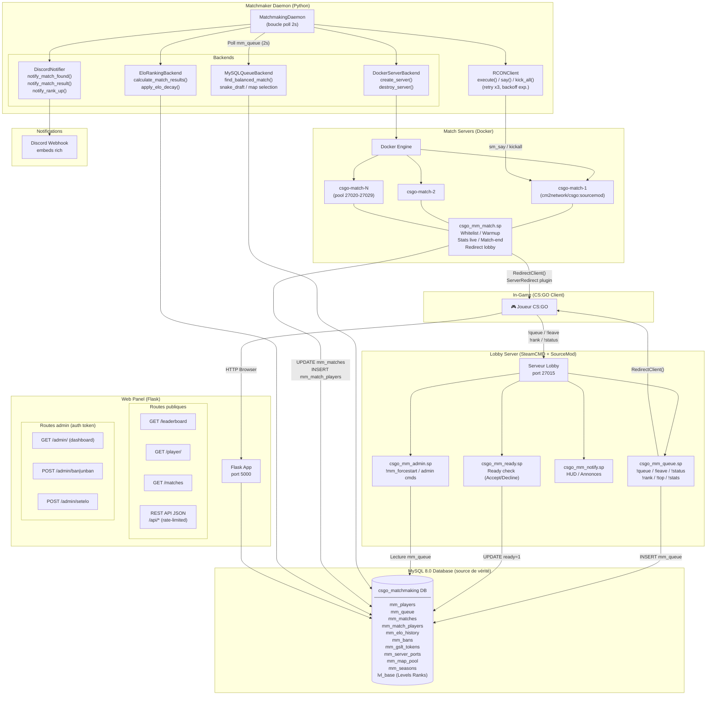
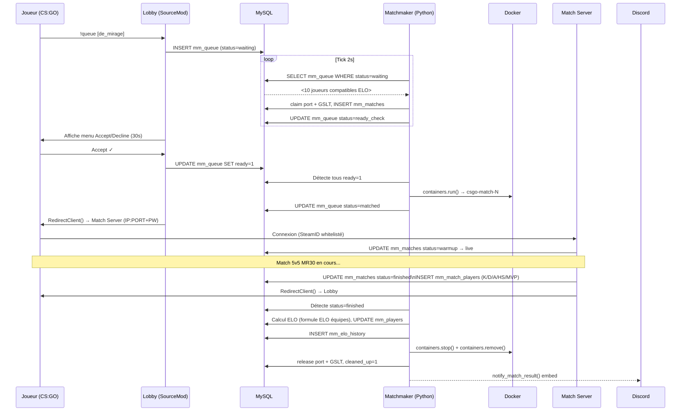
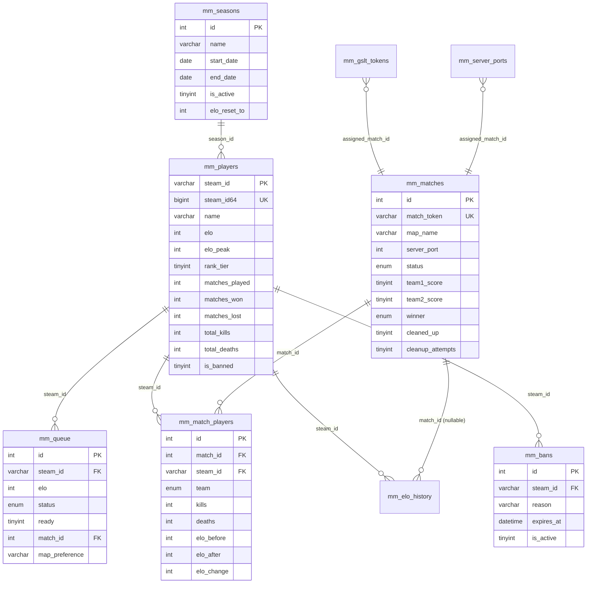

---

# CS:GO Matchmaking — Description fonctionnelle

## 1. Scope & Contexte

CS:GO Legacy (app Steam **740**) reste jouable depuis la transition vers CS2, mais Valve a fermé ses serveurs de matchmaking officiels. Ce projet est un **système de matchmaking compétitif communautaire**, autonome, non-commercial, destiné à rendre le matchmaking 5v5 classé de nouveau fonctionnel sur des serveurs privés.

Le système prend en charge l'intégralité du cycle de vie d'une partie compétitive : inscription en queue depuis le jeu, constitution des équipes, lancement d'un serveur dédié à la demande, suivi des statistiques en direct, retour automatique au lobby, et mise à jour du classement ELO.

---

## 2. Objectif

| Fonctionnalité | Description |
|---|---|
| **Queue in-game** | Les joueurs tapent `!queue` dans le chat du lobby CS:GO |
| **Matchmaking ELO** | Groupes de 10 joueurs compatibles par rang, équipes équilibrées |
| **Serveurs à la demande** | Un conteneur Docker par match, détruit après la partie |
| **Statistiques persistantes** | K/D, headshots, MVPs, historique ELO par joueur |
| **Panneau web public** | Classement, profils, historique des matchs |
| **Administration web** | Bans, modification ELO, dashboard des matchs en cours |
| **Notifications Discord** | Match trouvé, résultat, rank-up via webhook |

---

## 3. Architecture globale



---

## 4. Composants détaillés

### 4.1 Lobby Server (SourceMod)

Serveur CS:GO permanent sur le port **27015**, hébergeant 4 plugins SourceMod compilés en `.smx` :

| Plugin | Rôle |
|---|---|
| `csgo_mm_queue.sp` | Gestion complète de la queue : `!queue [map]`, `!leave`, `!status`, `!rank`, `!top`, `!stats`. Poll DB toutes les 2 s pour détecter les statuts `matched`. Anti-AFK (spec → dequeue après 5 min), rate-limiting 5 s par commande. |
| `csgo_mm_ready.sp` | Affiche le menu Accept/Decline (30 s) quand `status=ready_check`. Met à jour `ready=1` en DB. |
| `csgo_mm_notify.sp` | Messages HUD, annonces périodiques du nombre de joueurs en queue, notifications in-chat des événements. |
| `csgo_mm_admin.sp` | Commandes d'administration (`!mm_forcestart`, `!mm_cancel`, cibles par nom/SteamID). |

**Dépendances tiers** (vendorisées dans `vendor/`) : *Levels Ranks* (classement XP parallèle), *ServerRedirect* (plugin GAMMACASE pour rediriger les joueurs vers le serveur match).

### 4.2 Matchmaker Daemon (Python)

Daemon Python tournant en boucle infinie (intervalle configurable, défaut **2 s**). Chaque tick exécute 7 étapes en séquence :

```
1. _step_find_and_ready_check()    → Cherche 10 joueurs compatibles → ready check
2. _step_expire_stale_ready_checks() → Timeout 30 s → cancel + requeue
3. _step_create_servers()          → Docker containers pour groupes fully-ready
4. _step_process_finished_matches() → Calcul ELO + notif Discord
5. _step_cleanup_servers()         → Stop/rm containers + libération ports/GSLT
6. _step_expire_stale_queue_entries() → Expire entrées > 15 min
7. _step_cancel_timed_out_warmups() → Annule matchs warmup > 3 min sans joueurs
```

**Architecture modulaire par ABC** : chaque composant est swappable via `config.env` sans toucher au code principal :

| Interface ABC | Implémentation actuelle | Alternative prévue |
|---|---|---|
| `QueueBackend` | `MySQLQueueBackend` | `RedisQueueBackend` |
| `ServerBackend` | `DockerServerBackend` | `KubernetesServerBackend` |
| `RankingBackend` | `EloRankingBackend` | Glicko-2, TrueSkill |
| `NotificationBackend` | `DiscordNotifier` | Slack, Email |

**Robustesse** :
- Backoff exponentiel sur erreurs DB consécutives (max 5 → jusqu'à 120 s de sleep)
- `try/except` autour de chaque `containers.run()` → `status=error` + libération des ressources
- Compteur `cleanup_attempts` : force `cleaned_up=1` après 5 échecs (évite boucle infinie)
- Pool DB avec `connection_timeout=10 s`
- RCON : retry × 3 avec backoff exponentiel (1 s, 2 s), pas de retry sur `WrongPassword`

### 4.3 Serveur Match (Docker)

Image Docker basée sur `cm2network/csgo:sourcemod`. Chaque match = 1 conteneur :

- **Réseau** : `network_mode=host` (port UDP directement sur l'interface hôte)
- **Limite mémoire** : 2 Go par conteneur
- **Configuration** : toutes les variables injectées via `env` (match token, SteamIDs des équipes, IP/port du lobby, credentials DB, GSLT)
- **Plugin** `csgo_mm_match.sp` : whitelist SteamID stricte, tracking live des stats (K/D/A/HS/MVPs/damage), détection fin de match via `cs_win_panel_match`, écriture en DB, redirection automatique vers le lobby

**Pool de ressources** :
- **10 ports** pré-alloués en DB (27020-27029 + TV 27120-27129), claim/release atomique
- **N tokens GSLT** Steam (1 par serveur simultané), pool en DB

### 4.4 Web Panel (Flask)

Application Flask sur le port **5000** :

**Routes publiques (lecture seule) :**

| Route | Description |
|---|---|
| `/leaderboard` | Top joueurs par ELO avec win rate et K/D |
| `/player/<steam_id>` | Profil complet + historique ELO |
| `/matches` | Historique des matchs terminés |
| `/api/queue/count` | Nombre de joueurs en queue (60 req/min) |
| `/api/player/<id>` | Stats JSON (30 req/min) |
| `/api/leaderboard` | Top JSON (20 req/min) |
| `/api/matches` | Matchs récents JSON (20 req/min) |

**Routes admin (auth requise) :**

| Route | Description |
|---|---|
| `GET /admin/` | Dashboard : matchs en cours, queue, containers actifs |
| `GET /admin/bans` | Liste des bans actifs |
| `POST /admin/ban` | Bannir (SteamID, durée, raison) |
| `POST /admin/unban` | Lever un ban |
| `POST /admin/setelo` | Modifier l'ELO (0-9999) + log dans `mm_elo_history` |

**Authentification admin** : double mode — session Flask (formulaire web) ou `Authorization: Bearer <token>` (API). Token 48 chars hex stocké dans `config.env` (variable `ADMIN_TOKEN`), comparaison `secrets.compare_digest` (résistant aux timing attacks).

**Rate limiting** : Flask-Limiter avec stockage `SimpleCache`, clé = IP distante.

---

## 5. Schéma du cycle de vie d'un match



---

## 6. Système ELO

**Paramètres :**

| Paramètre | Valeur |
|---|---|
| ELO de départ | 1 000 |
| K-factor placement (< 10 matchs) | 64 |
| K-factor standard (10–29 matchs) | 32 |
| K-factor vétéran (≥ 30 matchs) | 24 |
| Spread initial | 200 ELO |
| Élargissement spread | +50 ELO / 60 s d'attente |

**Formule** : ELO standard `K × (S - E)` où `E = 1 / (1 + 10^((ELO_ennemi - ELO_joueur)/400))`. La baseline est la **moyenne ELO de l'équipe** adverse.

**18 rangs** : Silver I (0 ELO) → The Global Elite (2 000+ ELO)

**Decay** : −10 ELO/semaine après 2 semaines d'inactivité, plancher = ELO minimum du rang actuel.

**Constitution des équipes** (snake draft) :

```
Joueurs triés ELO desc : P1 P2 P3 P4 P5 P6 P7 P8 P9 P10
Assignation              : T1 T2 T2 T1 T1 T2 T2 T1 T1 T2
→ Différence ELO entre équipes quasi-minimale
```

**Sélection de map** : vote majoritaire parmi les préférences des 10 joueurs ; en cas d'égalité, tirage pondéré depuis `mm_map_pool` (7 maps actives, poids configurables).

---

## 7. Schéma de la base de données



---

## 8. Sécurité & reproducibilité

| Domaine | Mesure |
|---|---|
| **API web** | Rate limiting par IP sur tous les endpoints JSON (20–60 req/min) |
| **Admin** | Auth Bearer token (48 chars hex) + `secrets.compare_digest` anti-timing |
| **RCON** | Retry limité × 3 + backoff, jamais de retry sur erreur d'auth |
| **Docker** | Mémoire limitée à 2 Go par container, `restart_policy=no` |
| **Checksums** | SHA256 vérifié sur MetaMod et SourceMod téléchargés (`install.sh`) |
| **Plugins tiers** | Binaires `.smx` vendorisés dans `vendor/` (versions pinées, 0 download runtime) |
| **Lockfiles Python** | `requirements-lock.txt` par composant (`pip freeze`) → builds reproductibles |
| **Cleanup** | Max 5 tentatives avant force-clean d'un container bloqué (log ERROR) |

---

## 9. Déploiement

L'installation est entièrement gérée par `install.sh` (wizard interactif, idempotent) :

1. Détection OS (Ubuntu/Debian, RHEL/CentOS/Fedora, Arch, macOS)
2. Installation Docker CE, MySQL 8.0, Python 3.10+, SteamCMD
3. Téléchargement et vérification SHA256 de CS:GO (app 740), SourceMod, MetaMod
4. Configuration interactive (IP publique, passwords, pool GSLT, map pool)
5. Génération de `config.env` avec `ADMIN_TOKEN` aléatoire (48 chars hex)
6. Build de l'image Docker `csgo-match-server:latest`
7. Setup des services systemd (lobby, matchmaker, webpanel)
8. Validation finale (MySQL, Docker, ports, daemon)

**Stack technique résumée :**

```
Lobby Server  : SteamCMD + SourceMod 1.11 + MetaMod 1.11
Match Servers : Docker + cm2network/csgo:sourcemod
Matchmaker    : Python 3.11, docker-py, mysql-connector-python
Web Panel     : Flask 3.x, Flask-Limiter, Flask-Caching, SQLAlchemy
Database      : MySQL 8.0
Notifications : Discord Webhooks
CI            : SourcePawn Compiler 1.12 (0 warning)
```